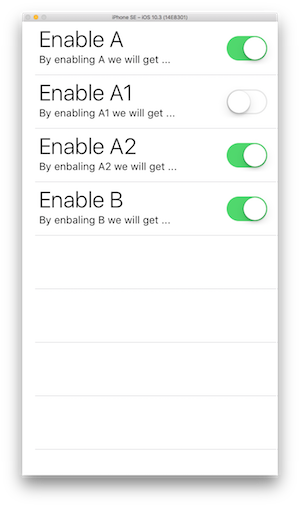

# EntitasKit

[](https://travis-ci.org/mzaks/EntitasKit)
[](https://codecov.io/gh/mzaks/EntitasKit)
[](https://github.com/Carthage/Carthage)


EntitasKit is a member of Entitas family. Entitas is a framework, which helps developers follow [Entity Component System architecture](https://en.wikipedia.org/wiki/Entity–component–system) (or ECS for short). Even though ECS finds it roots in game development. Entitas proved to be helpful for App development.

It can be used as:
- [service registry](https://en.wikipedia.org/wiki/Service_locator_pattern)
- strategy for [event driven programming](https://en.wikipedia.org/wiki/Event-driven_programming)
- highly flexible data model, based on generic [product type](https://en.wikipedia.org/wiki/Product_type)

Applications designed with ECS, are proved to be easy to unit test and simple to change.

## How does it work

Let's imagine we have an app which has a NetworkingService. This networking service is implemented as a class or a struct, we really don't care 😉. We need to be able to use this networking service from multiple places in our app. This is a typical use case for service locator pattern.

### How can we make it work with EntitasKit?
First we need to import EntitasKit and create a context.
```
import EntitasKit

let appContext = Context()
```
Now we need to define a _component_ which will hold reference to our networking service:
```
struct NetworkingServiceComponent: UniqueComponent {
    let ref: NetworkingService
}
```

The component is defined as _unique component_, this means that a context can hold only one instance of such component. And as a matter of fact, we would like to have only one networking service present in our application.
Now lets setup our context.

```
func setupAppContext() {
    appContext.setUniqueComponent(NetworkingServiceComponent(ref: NetworkingService()))
}
```

In the setup function, we instantiate networking service component with an instance of networking service and put the component into our app context.

Now, if we want to call `sendMessage` method on our networking service, we can do it as following:

```
appContext.uniqueComponent(NetworkingServiceComponent.self)?.ref.sendMessage()
```

I mentioned before that EntitasKit makes it easy to test your app. This is due to the fact, that even though the networking service is unique in your app it can be easily replaced/mocked in your test. Just call this in your test setup method.

```
appContext.setUniqueComponent(NetworkingServiceComponent(ref: NetworkingServiceMock()))
```

And call `setupAppContext()` during tear down.

---

Let me show you another typical problem which can be solved with service registry and EntitasKit.

Imagine you have an app and there is an unfortunate feature requirement. You need to show a modal view controller on top of another modal view controller. And than, there needs to be a way, not only to discard the current modal view controller, but all modal view controllers.

For this use case we will create another _component_:

```
struct ModalViewControllerComponent: Component {
    weak var ref: UIViewController?
}
```

This time our _component_ is not unique and the field of the component is a _weak_ reference to `UIViewController`. The reference should be weak because we don't want to retain a view controller in our context. It should be retained only through our view controller hierarchy.

In the `viewDidLoad` method of the modal view controller, we can register our view by adding following line:

```
appContext.createEntity().set(ModalViewControllerComponent(ref: self))
```

As you can see, this time we create an entity and set modal view controller component on it, referencing `self`. Entity is a very generic product type, which can hold any instance which implements `Component` or `UniqueComponent` protocol. The only caveat is that it cannot hold multiple instances of the same type.

Let's assume, we have a situation where we showed multiple modal view controller and want to dismiss them all. How can we do it?

```
for entity in appContext.group(ModalViewControllerComponent.matcher) {
    entity.get(ModalViewControllerComponent.self)?.ref?.dismiss(animated: false, completion: nil)
    entity.destroy()
}
```

In the code above, we see that we can ask context for group of entities which have `ModalViewControllerComponent`. `Group` implements `Sequence` protocol, this is why we can iterate through entities in it. Access the modal view controller component and call `dismiss` method on it's reference. We than destroy the entity, because we don't need to hold the reference to the modal view controller any more.

---

## Strategy for event driven programming

An event in Entitas is also just a component

```
let eventContext = Context()

struct MyEventComponent: Component {}
```

As you can see, we defined a context for events and a component `MyEvent`. The component does not have properties in this case, but it is ok to have an event which transports data. It is just not needed in our example.

Now we need to describe the observer

```
protocol EventObserver: class {
    func eventDidOccur()
}

struct EventObserverComponent: Component {
    weak var ref: EventObserver?
}
```

We defined a protocol which classes has to implement in order to become an event observer. I decided to restrain the implementors to classes because, mostly the event observers are UIKit classes and this way, we can define the reference in the `EventObserverComponent` as `weak`. However if you wan to decouple event observing from UIKit, you can rethink this restriction.

The component we defined are very similar to what we did in the service registry part. However now we will introduce something new.

```
class MyEventNotifyObserverSystem: ReactiveSystem {
    let collector: Collector = Collector(group: eventContext.group(MyEventComponent.matcher), type: .added)
    let name = "Notify event observer"
    let observers = eventContext.group(EventObserverComponent.matcher)

    func execute(entities: Set<Entity>) {
        for observer in observers {
            observer.get(EventObserverComponent.self)?.ref?.eventDidOccur()
        }
    }
}
```

We introduced a reactive system. A reactive system is something like a reducer, if you are familiar with [Redux](http://redux.js.org/docs/Glossary.html#reducer) or [ReSwift](http://reswift.github.io/ReSwift/master/getting-started-guide.html). However, reactive systems are triggered by state change not an explicit action.

When we implement a `ReactiveSystem` protocol we need to provide two properties:
- name, this is just a string used for logging
- collector, an instance of a class which will monitor a group and collect entities on a defined collection change type

In our example we define, that we want to collect from a group of `MyEventComponent` entities. And we would like to collect them when they enter the group. Meaning that when we create a new entity and set `MyEventComponent` for the first time, this entity gets collected.

So if we have something like this in a view controller:

```
    @IBAction func buttonPushed(sender: Any) {
        eventContext.createEntity().set(MyEventComponent())
    }
```

Our button pushed "event" will be processed by `MyEventNotifyObserverSystem`.

To define the "processing" logic we have to implement the `execute(entities:)` method. As we can see in the listing above, to make it all work, we just walk through observers and call `eventDidOccur`.

If a view controller would register itself as observer

```
    override func viewDidLoad() {
        super.viewDidLoad()
        eventContext.createEntity().set(EventObserverComponent(ref: self))
        ...
    }
```

We will get something people call unidirectional data flow.

A reactive system by itself is not doing anything, it is just a definition of behavior. In order for it to run, we have to put it in a reactive loop

```
let eventLoop = ReactiveLoop(ctx: eventContext, systems: [MyEventNotifyObserverSystem()])
```

Now if we push the button, event loop will trigger the reactive system, which will call all registered observers.

---

As you can see the `buttonPushed` `IBAction` is creating new entities every time. This means that we are polluting memory with all this previous events. Now don't get me wrong, specifically if the event would carry some data, it might be a desirable effect, but in our case we would like to clean up previous events. For this we can implement another reactive system

```
class MyEventCleanupSystem: ReactiveSystem {
    let collector: Collector = Collector(group: eventContext.group(MyEventComponent.matcher), type: .added)
    let name = "Event cleanup system"

    func execute(entities: Set<Entity>) {
        for e in entities {
            e.destroy()
        }
    }
}
```

and add it to the event loop

```
let eventLoop = ReactiveLoop(ctx: eventContext, systems: [MyEventNotifyObserverSystem(), MyEventCleanupSystem()])
```

As the execution order of systems is granted by `systems` array, we can be certain that a new event will be first processed by `MyEventNotifyObserverSystem` and than destroyed by `MyEventCleanupSystem`.

You might think, wouldn't it be easier to destroy the event entity directly in `MyEventNotifyObserverSystem` and skip definition of cleanup system? This might be true for a simple examples, but in complex applications it is better to stick to [single responsibility principal](https://en.wikipedia.org/wiki/Single_responsibility_principle) and therefor split up the notification and cleanup logic in to separate systems.

---

In previous section I mentioned that execution order of the systems is granted. Is the execution order of the observers granted as well?

In current implementation it is not and there are two reasons for it:
1. `Group` is backed by a `Set`, this means that when we iterate other a group we can't predict the order.
2. It is also hard to predict the order, when the observers will register. This call `eventContext.createEntity().set(EventObserverComponent(ref: self))` will be executed in different scenarios and decoupled from each other.

But no worries if the execution order is important in your use case it is a simple problem to fix.

We can introduce another component

```
struct ExecutionIndexComponent: Component {
    let value: Int
}
```

And let listeners/observers define there execution order

```
class Listener: EventObserver {
    let index: Int
    init(_ index: Int) {
        self.index = index
        eventContext.createEntity().set(EventObserverComponent(ref: self)).set(ExecutionIndexComponent(value: index))
    }
    func eventDidOccur() {
        print("!!!!! \(index)")
    }
}

let listeners = (1...10).map{Listener($0)}
```

Now we can write a new reactive system which will execute the observers in defined order.

```
class MyEventNotifyObserverInOrderSystem: ReactiveSystem {
    let collector: Collector = Collector(group: eventContext.group(MyEventComponent.matcher), type: .added)
    let name = "Notify event observer"
    let observers = eventContext.group(Matcher(all: [EventObserverComponent.cid,  ExecutionIndexComponent.cid]))

    func execute(entities: Set<Entity>) {
        let sortedObservers = observers.sorted(forObject: ObjectIdentifier(self)) { (e1, e2) -> Bool in
            return (e1.get( ExecutionIndexComponent.self)?.value ?? Int.max) < (e2.get( ExecutionIndexComponent.self)?.value ?? Int.max)
        }
        for observer in sortedObservers {
            observer.get(EventObserverComponent.self)?.ref?.eventDidOccur()
        }
    }
}
```

I want to point out two details in `MyEventNotifyObserverInOrderSystem`:

1. The `observers` field is now a more complex group. We say that it is a group of entities which have `EventObserverComponent` and `ExecutionIndex` components
2. We compute `sortedObservers` in the `execute` method. It recompute the sorted observers each time because than it is always up to date. This way we support removing and adding observers at runtime. Also as you can see we are using a special `sorted` method. It caches the result of the sorting, if group did not change.

Now as we have a reactive system which is responsible for notifying observers with execution order, let's change our `MyEventNotifyObserverSystem` to not handle observers with execution order. This can be done by exchanging the `observers` property definition

```
let observers = eventContext.group(Matcher(all: [EventObserverComponent.cid], none: [ExecutionIndexComponent.cid]))
```

Here we say that we need a group of entities which have `EventObserverComponent` but don't have `ExecutionIndexComponent`

Last, but not least. Lets update our event loop

```
let eventLoop = ReactiveLoop(ctx: eventContext, systems: [MyEventNotifyObserverSystem(), MyEventNotifyObserverInOrderSystem(), MyEventCleanupSystem()])
```

And we are done.

If you are interested to see all of the presented thing in action, please take following gist and put it into a PlayGround together with EntitasKit

https://gist.github.com/mzaks/f0fd31b2dc0f5d45b5ad077881de649d

## Highly flexible data model

In this section we will use all the knowledge we accumulated from the previous section and learn a bit more. As a use case, we will build an options menu. Imagine you have an app and you would like users be able to turn on and off some features.

A picture tells more than 1000 words so here is a screen shot of what the result will look like:



First things first let's define an options context:

```
import EntitasKit

let optionsCtx = Context()

struct OptionsBoolValueComponent: Component {
    let value: Bool
}

struct TitleComponent: Component {
    let value: String
}

struct DescriptionComponent: Component {
    let value: String
}

struct IndexComponent: Component {
    let value: Int
}

enum OptionsKey: String {
    case OptionA, OptionB
}

struct OptionsKeyComponent: Component {
    let value: OptionsKey
}
```

I previous sections we defined components to hold references, now we define components to hold data. An options entity should hold following components:
- boolean value component which hold the information if the option is enabled or disabled
- title string, which defines the title of the options the table view
- description string, which defines the description in the options table view
- index of the entry in the table
- and an options key, as you can see we define that we can have two options _A_ and _B_

As you can see we slice our components very thin (every component has only one property). This way it is much more robust for change and implementation of reactive behavior.

In order to setup options context we need to configure the options. Here is an example how you can do it in code:

```
struct OptionsConfigData {
    let key: OptionsKey
    let index: Int
    let title: String
    let description: String
    let defaultValue: Bool
}

let optionsConfig = [
    OptionsConfigData(key: .OptionA,
                      index: 0,
                      title: "Enable A",
                      description: "By enabling A we will get ...",
                      defaultValue: true
    ),
    OptionsConfigData(key: .OptionB,
                      index: 1,
                      title: "Enable B",
                      description: "By enabling B we will get ...",
                      defaultValue: false
    )
]
```

But you could also do it with JSON, plist or what ever comes to mind. Important is that we can declare what kind of options we would like to have in our app.

Here is the options context setup logic:

```
func setupOptionsContext() {
    for option in optionsConfig {
        let e = optionsCtx.createEntity()
            .set(OptionsKeyComponent(value: option.key))
            .set(IndexComponent(value: option.index))
            .set(TitleComponent(value: option.title))
            .set(DescriptionComponent(value: option.description))

        let value = (UserDefaults.standard.object(forKey: option.key.rawValue) as? Bool) ?? option.defaultValue

        e.set(OptionsBoolValueComponent(value: value))
    }
}
```

As you can see it is quite simple. We iterate over every option and create a corresponding entity. We also decide to persist the options in user defaults. If it is not there yet, we will just get a default value from our config. Keeping our options in CoreData, Realm or even at remote BackEnd would be also simple, but will not be covered in this tutorial.

Now let's have a look at our view controller:

```
class ViewController: UITableViewController {

    var items = optionsCtx.group(Matcher(all:[OptionsKeyComponent.cid, IndexComponent.cid]))

    override func tableView(_ tableView: UITableView, numberOfRowsInSection section: Int) -> Int {
        return items.count
    }

    override func tableView(_ tableView: UITableView, cellForRowAt indexPath: IndexPath) -> UITableViewCell {
        guard let cell = tableView.dequeueReusableCell(withIdentifier: "BoolOptionCell") as? BoolOptionCell else {
            return UITableViewCell()
        }

        cell.setEntity(e: getItem(indexPath: indexPath))
        return cell
    }

    private func getItem(indexPath: IndexPath) -> Entity{
        return items.sorted(forObject: ObjectIdentifier(self), by: { (e1, e2) -> (Bool) in
            let i1 = e1.get(IndexComponent.self)?.value ?? 0
            let i2 = e2.get(IndexComponent.self)?.value ?? 0
            return i1 < i2
        })[indexPath.row]
    }    
}
```

It is a simple table view controller. The items are backed by a group of entities which have options key component and index component. The row count is directly determined b the group. The cell is a special type which has a `setEntity` method. We get the entity by sorting the items by index component value.

Here is the implementation of `BoolOptionCell`:

```
class BoolOptionCell: UITableViewCell {

    @IBOutlet weak var titleLabel: UILabel!
    @IBOutlet weak var descriptionLabel: UILabel!
    @IBOutlet weak var optionsSwitch: UISwitch!

    weak var entity: Entity?

    @IBAction func optionSwitched(_ sender: UISwitch) {
        entity?.set(OptionsBoolValueComponent(value: sender.isOn))
    }

    func setEntity(e : Entity){
        self.entity = e
        titleLabel.text = e.get(TitleComponent.self)?.value
        descriptionLabel.text = e.get(DescriptionComponent.self)?.value
        if let boolComponent: OptionsBoolValueComponent = e.get() {
            optionsSwitch.setOn(boolComponent.value, animated: true)
        }
    }
}
```

It has `IBOutlet` to title/description label and also to the options switch. Those will be updated when `setEntity` method is called. We also hold a weak reference to the backing entity. This way we can set the boolean value on the entity in the `IBAction`.

Last but not least, we would like to persist, the value of the changed option entry. This we can do we a reactive system.

```
class PersistOptionsSystem: ReactiveSystem {
    let collector: Collector = Collector(
        group: optionsCtx.group(
            Matcher(
                all: [OptionsBoolValueComponent.cid, OptionsKeyComponent.cid]
            )
        ),
        type: .updated
    )
    let name = "Options persisting"

    func execute(entities: Set<Entity>) {
        for e in entities {
            guard let boolComponent: OptionsBoolValueComponent = e.get(),
                let keyComponent: OptionsKeyComponent = e.get() else {
                    continue
            }
            UserDefaults.standard.set(boolComponent.value, forKey: keyComponent.value.rawValue)
        }
    }
}
```

We collect updated entities inside of the group over OptionsBoolValueComponent and OptionsKeyComponent. Meaning that entities which have both components are in the group and if we replace one of the components than this entity will be collected and passed to `execute(entities:)` method.

In the `execute(entities:)` unpack bool and key components and set the value for key in user defaults.

To tight it all together lets update our app delegate to setup options context and hold a reference to reactive loop:

```
func application(_ application: UIApplication, didFinishLaunchingWithOptions launchOptions: [UIApplicationLaunchOptionsKey: Any]?) -> Bool {
        setupOptionsContext()

        optionsLoop = ReactiveLoop(ctx: optionsCtx, systems: [
            PersistOptionsSystem()
        ])

        return true
    }
```

Now we have a great way of declaring storing persisting and displaying the options. But what about querying the options in other places of our app. We could use a group similar to the one we used in our table view controller and than filter it for option type we are interested in, but there is a better way in EntitasKit. We can define an index over component values:

```
let optionsKeyIndex = optionsCtx.index { (comp: OptionsKeyComponent) -> OptionsKey in
    return comp.value
}
```

This way we can query for options as following `optionsKeyIndex[.OptionA1].first`. More on it in the next section.

---

Let's spice it up a bit let's say we want to add two more options _A1_ and _A2_

```
enum OptionsKey: String {
    case OptionA, OptionB, OptionA1, OptionA2
}

let optionsConfig = [
    OptionsConfigData(key: .OptionA,
                      index: 0,
                      title: "Enable A",
                      description: "By enabling A we will get ...",
                      defaultValue: true
    ),
    OptionsConfigData(key: .OptionB,
                      index: 3,
                      title: "Enable B",
                      description: "By enbaling B we will get ...",
                      defaultValue: false
    ),
    OptionsConfigData(key: .OptionA1,
                      index: 1,
                      title: "Enable A1",
                      description: "By enabling A1 we will get ...",
                      defaultValue: true
    ),
    OptionsConfigData(key: .OptionA2,
                      index: 2,
                      title: "Enable A2",
                      description: "By enbaling A2 we will get ...",
                      defaultValue: true
    )
]
```

And we have a nasty feature requirement. If we turn of option A, options A1 and A2 should also be turned off. If we turn on A1 or A2 option A should be turned on as well. This is btw. an actual real world use case I had to implement a few months ago.

This is a reactive system which will implement the logical part of the turn of A1 and A2 if A got turned of:

```
class SwitchChildrenOfOptionASystem: ReactiveSystem {
    let collector: Collector = Collector(
        group: optionsCtx.group(
            Matcher(
                all: [OptionsBoolValueComponent.cid, OptionsKeyComponent.cid]
            )
        ),
        type: .updated
    )
    let name = "Switching off A1 and A2 when A got switched off"

    func execute(entities: Set<Entity>) {
        guard
            let optionA = entities.first(where: { (e) -> Bool in
                return e.get(OptionsKeyComponent.self)?.value == .OptionA
            }),
            let aIsOn = optionA.get(OptionsBoolValueComponent.self)?.value,
            let optionA1 = optionsKeyIndex[.OptionA1].first,
            let optionA2 = optionsKeyIndex[.OptionA2].first
            else {
            return
        }

        if aIsOn == false {
            if optionA1.get(OptionsBoolValueComponent.self)?.value != false {
                optionA1.set(OptionsBoolValueComponent(value: false))
            }
            if optionA2.get(OptionsBoolValueComponent.self)?.value != false {
                optionA2.set(OptionsBoolValueComponent(value: false))
            }
        }
    }
}
```

I called it the logical part because here we only change the boolean value of options A1 and A2 if they are not set to false yet. We don't manipulate the UI. In order to update the table view we need to introduce another component:

```
struct OptionsDisplayComponent: UniqueComponent {
    weak var ref: ViewController?
}
```

And override the `viewDidLoad` method on the view controller and introduce a new method `updateCell`:

```
    override func viewDidLoad() {
        super.viewDidLoad()
        optionsCtx.setUniqueComponent(OptionsDisplayComponent(ref: self))
    }

    func updateCell(at: Int) {
        let indexPath = IndexPath(row: at, section: 0)
        guard let cell = tableView.cellForRow(at: indexPath) as? BoolOptionCell else {
            return
        }
        cell.setEntity(e: getItem(indexPath: indexPath))
    }
```

Now let's implement the reactive system which will handle the updates of the ui:

```
class UpdateOptionsDisplaySystem: ReactiveSystem {
    let collector: Collector = Collector(
        group: optionsCtx.group(
            Matcher(
                all: [OptionsBoolValueComponent.cid, IndexComponent.cid]
            )
        ),
        type: .updated
    )
    let name = "Update options cells on value change"

    func execute(entities: Set<Entity>) {
        for e in entities {
            guard let index = e.get(IndexComponent.self)?.value else {
                continue
            }
            optionsCtx.uniqueComponent(OptionsDisplayComponent.self)?.ref?.updateCell(at: index)
        }
    }
}
```

Let's introduce a system which will implement the second part of our requirement - enable option A if A1 or A2 get enabled:

```
class SwitchParentOfOptionASystem: ReactiveSystem {
    let collector: Collector = Collector(
        group: optionsCtx.group(
            Matcher(
                all: [OptionsBoolValueComponent.cid, OptionsKeyComponent.cid]
            )
        ),
        type: .updated
    )
    let name = "Switching on A when A1 or A2 got switched on"

    func execute(entities: Set<Entity>) {
        for e in entities {
            guard e.get(OptionsKeyComponent.self)?.value == .OptionA1 || e.get(OptionsKeyComponent.self)?.value == .OptionA2 else {
                continue
            }
            guard let isON = e.get(OptionsBoolValueComponent.self)?.value,
                let optionA = optionsKeyIndex[.OptionA].first
                else {
                continue
            }
            if isON && optionA.get(OptionsBoolValueComponent.self)?.value != true {
                optionA.set(OptionsBoolValueComponent(value: true))
            }
        }
    }
}
```

Last thing we need to do is to update our AppDelegate

```
    func application(_ application: UIApplication, didFinishLaunchingWithOptions launchOptions: [UIApplicationLaunchOptionsKey: Any]?) -> Bool {

        setupOptionsContext()

        optionsLoop = ReactiveLoop(ctx: optionsCtx, systems: [
            PersistOptionsSystem(),
            SwitchChildrenOfOptionASystem(),
            UpdateOptionsDisplaySystem(),
            SwitchParentOfOptionASystem()
        ])

        return true
    }
```

All code for this example can be found here:
https://gist.github.com/mzaks/c1428efcbbbb0c0c430537715afea8c6

## Entitas family
- [C#](https://github.com/sschmid/Entitas-CSharp)
- [C++](https://github.com/JuDelCo/Entitas-Cpp)
- [Objective-C](https://github.com/wooga/entitas)
- [Java](https://github.com/Rubentxu/entitas-java)
- [Python](https://github.com/Aenyhm/entitas-python)
- [Scala](https://github.com/darkoverlordofdata/entitas-scala)
- [Go](https://github.com/wooga/go-entitas)
- [F#](https://github.com/darkoverlordofdata/entitas-fsharp)
- [TypeScript](https://github.com/darkoverlordofdata/entitas-ts)
- [Kotlin](https://github.com/darkoverlordofdata/entitas-kotlin)
- [Haskell](https://github.com/mhaemmerle/entitas-haskell)
- [Erlang](https://github.com/mhaemmerle/entitas_erl)
- [Clojure](https://github.com/mhaemmerle/entitas-clj)
